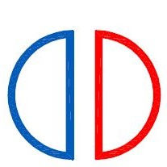

# Smart Associates
> ## Consulting Civil & Structural Engineers

[View Happy Hands website here](https://mgreenberry.github.io/ms2-smart-associates/)

## About

This is a MS2 Interactive Frontend Development Milstone Project website created as part of a Full Stack Software Development in Code Institute by [Michael Greenberry](https://www.linkedin.com/in/michael-greenberry-637299108/).

I created this interactive website to provide a professional and simple website for a Civil and Structural Engineering company I work for.

The website targets customers and clients that would require the use of a civil and/or structural engineering services provided by the company I work for. 

The goal of this website is to provide information about Smart Associates, and the services it provides. It also provides interactive pages showing some of the projects the company has been involved in and a contact us page. 

This website must be professional for the target audience and contain the information needed to complete the goals of the business owner and site visitors. It must also stand out and be memorable for future visits and for recommendations to other potential users.

## Table of contents
1. [UX - User Experience](#ux-user-experience)
   * [Project Goals](#project-goals)
   * [User Stories](#user-stories)
   * [Design Choices](#design-choices)
     1. [Typography](#typography)
     2. [Colours](#colours)
     3. [Imagery](#imagery)
     4. [Icons](#icons)
     5. [Layout](#layout)
   * [Wireframes](#wireframes)
2. [Features](#features)
   * [Existing Features](#existing-features)
     1. [All Pages](#all-pages)
     2. [index.html](#index)
     3. [about-us.html](#about-us)
     4. [services.html](#services)
     5. [projects.html](#projects)
     6. [contact-us.html](#contact-us)
     7. [404.html](#404)
   * [Features Left To Implement](#features-left-to-implement)
3. [Technologies Used](#technologies-used)
   * [Languages](#languages)
   * [Framework Library](#framework-library)
   * [Tools](#tools)
   * [Testing Tools](#testing-tools)
4. [Testing](TESTING.md)
5. [Deployment](#deployment)
   * [Project creation](#project-creation)
   * [Deployment of existing site](#deployment-of-existing-site)
   * [Forking](#forking)
   * [Cloning and Implementing Locally](#cloning-and-implementing-locally)
6. [Credits](#credits)
   * [Content](#content)
   * [Media](#media)
   * [Icons](#icons)
   * [Code](#code)
     1. [HTPS](#https)
     2. [CSS](#css)
7. [Acknowledgements](#acknowledgements)
8. [Author Information](#author-information)

## UX (User Experience)

For this website and business I looked online for family friendly sign language courses for British Sign Language (BSL). I found a few companies that provided sign language for babies and adults, but very few that provided for the whole family. Some of the websites taught sign language using Signed Supported English, or Makaton. However, I wanted to provide a website that would cover all ages and still provide a rich and meaningful experience. I choose British Sign Language as it is used by over 125,000 people use BSL as their first or preferred language.

### Project Goals
* To provide a easy to understand website for the user to learn British Sign Language (BSL)
* To introduce Happy Hands, a child friendly website in British Sign Language
* To provide British Sign Language lessons to children and their families
* To provide a brief explanation about British Sign Language (BSL)
* To provide a contact form for more information
* To provide a downloadable pdf fingerspelling document
* To demonstrate some sample lessons on video
* To provide a BSL translation of all internet pages

### User Stories

* As a user visiting the site for the first time:
  1. I want to be able to use the website on any device I own or use
  2. I want to able to learn and easily understand what the website is about
  3. I want to easily understand about the courses provided
  4. I want an attractive home page introducing HAPPY HANDS
  5. I want to click on navigation links to be taken to the correct page/section and to be able to return to the home page or another page without using the brower forward/backward buttons
  6. I want these navigation links to include user friendly menus which are easy to uderstand and use
  7. I want the content to be easy to read and have a predictable layout so that each page can be navigated easily
  8. I want to be able to click and visit social media, Facebook, Twitter and others for more content and to keep up to date with future postings and developments
  9. I want to access sample lessons and other content for various age ranges
  10. I want to provide make contact with the business owner for more information
  11. I want to see the people involved with teaching the lessons
  12. I want to see reviews and testimonials from other users
  13. I want to access contact information, such as address, phone numbers and location
  14. I want to be able to access this information if I am deaf and rely on BSL
  15. I want to know the price for and time for each lessons
  16. I want to know that my child is safe and that tutors have the necessary qualificaitons and checks in place

* HAPPY HANDS will do this by:-
  1. Design a responisive website focussed for mobile devices and responsive to larger screens.
  2. Design an easy to read home page (index.html) which gives some brief information about the website and it's aims and goals
  3. Design 2 distinct sections which highlight the language (BSL) and the courses available
  4. Design 1 section on the home page about the company Happy Hands as an 'about us'
  5. Design and impliment a navigation bar which contains links to different pages and sections in the website 
  6. Design and label the navigation bar with clear and understandable text to direct users to the correct page  
  7. Design the website to have good readability throughout and avoid using black on white text for those with Meares-Irlen Syndrome, Dyslexia or other reading difficulties
  8. Design Social Media interactive buttons which direct user to the social media platform they wish to interact with.
  9. Design and create videos and packs for users to watch and download  
  10. Design a contact form which can be submitted (or cleared if errors made)
  11. Design a 'tutors.html' page with information on teachers 
  12. Design a reviews and testimonials section
  13. Design a footer with contact details such as address, phone number and location via a map 
  14. Design a link in the footer to a Zoom call for BSL users and video content
  15. Design a section within the tutors.html page with information on prices and times
  16. Design a section within the tutors.html and index.html which offers confirmation of checks and tutor information

* As a user returning to the site:
  1. I want to be able to watch video content provided by the business
  2. I want to be able to easily find content I am interested in
  3. I want to be able to contact the business owner by various means, such as contact form, social media, video call, etc

* Happy Hands will do this by:
  1. Design and provide embedded YouTube videos with user controls
  2. Design an easy to use and friendly navigation bar and clickable buttons on each page
  3. Design a contact form section/page. Also provide social media buttons and a contact us on each page at the bottom

[Back to content](#table-of-contents)
### Design Choices

#### Typography

For fonts, I used [Google Fonts](https://fonts.google.com) for my website. 

I have chosen the font-family: ['Poppins'](https://fonts.google.com/specimen/Poppins/), sans-serif; for the Headings and Menu sections of the website as it is easy to read and has a nice cursive font which matches the style of the website. I also felt this fitted in well with the child and family friendly design of the website.

I've chosen the font-family: ['Roboto'](https://fonts.google.com/specimen/Roboto/), monospace; for the paragraph and other aspects of the site as it is a good match and pairs well with the Poppins font. 

#### Colours

For this website I chose a colour pallette that matched similar websites that are colourful and child friendly. The background colour is Cyan, the Nav bar and button text is Cobalt Blue and menus, some text and buttons are Corn yellow as a good contrast to the main colour.

The colours I picked are as follows: -

From: [Coolors Palette](https://coolors.co/1446a0-ccfbfe-f2e86d)

#### Imagery

All other images were sourced from www.shutterstock.com as part of a free trial to download 10 images. 

* All pages:

  * Happy Hands: [Hero Image](assets/images/logos-images/happy-hands.jpg) - Happy Hands was designed by Michael Greenberry using the Sketches Pro app by Tayashi on Apple iPad.

* index.html

  1. BSL image: Image by [Cath Smith](assets/images/logos-images/bsl-3.jpg) from www.letssign.co.uk.
  2. Sign Language Deaf Disabled People Video Conference: Photo by [Andrey Popov](https://www.shutterstock.com/g/apops) from [Shutterstock](https://www.shutterstock.com/image-photo/sign-language-deaf-disabled-people-video-1813787960)
  3. Hands Sign Language Circle: Photo by [Darelle](https://pixabay.com/users/darelle-427220/?utm_source=link-attribution&utm_medium=referral&utm_campaign=image&utm_content=541830) from [Pixabay](https://pixabay.com/photos/hands-sign-language-circle-541830/)

* lessons.html
  1. Little girl smiling with love hand: Photo by [Wisansaya Suksong](https://www.shutterstock.com/g/ampsuksong) from [Shutterstock](https://www.shutterstock.com/image-photo/portrait-cute-little-girl-smiling-love-1158105028)
  2. Smiling indian latin deaf child: Photo by [insta_photos](https://www.shutterstock.com/g/instaphotos) from [Shuttercock](https://www.shutterstock.com/image-photo/smiling-indian-latin-deaf-disabled-child-1814238713)
  3. Smiling teenage girl deaf: Photo by [Leoschka](https://www.shutterstock.com/g/Leoschka) from [Shuttercock](https://www.shutterstock.com/image-photo/smiling-teenage-girl-deaf-disabled-child-1943311720)
  4. Young black female in hijab: Photo by [Prostock-studio](https://www.shutterstock.com/g/prostock_studio) from [Shuttercock](https://www.shutterstock.com/image-photo/online-education-young-black-female-teacher-1859693998)
  * Video contect from business owner

* tutors.html
  * All content from business owner

* download.html

  1. Fingerspelling/Alphabet download and images: [left](assets/images/logos-images/lh-alphabet.jpg) and [right](assets/images/logos-images/rh-alphabet.jpg) hand alphabet fingerspelling documents/images by [Cath Smith](https://www.letssign.co.uk)

* success.html

  1. Thankyou image on success page: [Cath Smith](assets/images/logos-images/thankyou.jpg) from www.letssign.co.uk

### Icons

All icons for Social Media were sourced form [Font Awesome](https://fontawesome.com/)

### Layout

This website is designed with access from the home page to all other pages from the navigation bar. Some pages also include links to other pages, i.e. index.html links to both lessons.html and tutors.html. 

However, the 404.html and the success.html pages are not accessed from the navigation bar or from any of the pages of the website. The 404.html page only displays when a user enters or searches for a page that doens't exist. The success.html page only displays when a user has sucessfully completed the contact form in contact-us.html. Both the 404.html and the success.html pages allow the user to navigate to the main website.

 

This blueprint was then used to design the navigation and call-out buttons featured in the website.

[Back to content](#table-of-contents)
## Wireframes
I have attached mock ups of the original ideas and final design ideas before I used Wireframes to create a prototype. These initial drawings and ideas are [here](assets/images/readme-images/initial-ideas.pdf)

I used Balsamiq to create my wireframes. I chose to do a mobile version first with the pages I wanted and then create a desktop version after. I did this as this was going to be the way I designed my website, mobile first.

The following wireframes:

Samsung Phone
* [index.html](assets/images/readme-images/hhmobile-index.png)
* [lessons.html](assets/images/readme-images/hhmobile-lessons.png)
* [faqandcontact.html](assets/images/readme-images/hhmobile-faq-contactus.png)

Apple iPad
* I didn't create an iPad version before I started my website but once I had an index.html, I went back to finalise my design.

Generic laptop
* [index.html](assets/images/readme-images/hhdesktop-index.png)
* [lessons.html](assets/images/readme-images/hhdesktop-lessons.png)
* [faqandcontact.html](assets/images/readme-images/hhdesktop-faq-contact.png)

Once I started to create my website I realised I needed a lot more content and that I wanted to have a separate page for the contact-us section. I also decided to add a tutor.html, success.html for the form and a 404.html for wrong address input:

As I wanted to include this on all formats and devices I created my wireframes again for all pages and added the following to show mobile, tablet and desktop:

* [index.html](/assets/images/readme-images/index.html.png)
* [lessons.html](/assets/images/readme-images/lessons.html.png)
* [tutors.html](/assets/images/readme-images/tutors.html.png)
* [download.html](/assets/images/readme-images/download.html.png)
* [contact-us.html](/assets/images/readme-images/contact-us.html.png)

I then added a 'success.html' page for when the user submitted a completed form. I didn't design a wireframe for this.

I then added a '404.html. page for when the user enters an incorrect page address in the browser. I didn't create a wireframe for this page.

[Back to content](#table-of-contents)
## Features

### Existing Features

#### All pages

Every page contains the following features at the top of the website as standard: -
* A [image](/assets/images/logos-images/happy-hands.jpg) of Happy Hands to the left of the Navigation bar. Allows all users back to the home page by clicking the logo.
* Text as a header reading "Smart Associates"
* A responsive navigation bar, which reduces into a 'hamburger' navigation bar on mobiles. Allows all users to click on the page they want and access said page easily. Each navigation bar has the following links: -
  1. index.html - allows users to access the home page by clicking the home (index.html) text
  2. lessons.html - allows users to access the lessons offered by the business by clicking the lessons text
  3. tutors.html - allows users to access the tutors and see who teaches the lessons and the prices by clicking the tutors text
  4. free-content.html - allows users to access the free content available on the website and to download some free resources by clicking the Free Content page
  5. contact-us.html - allows users to make contact with the business by filling in a form and pressing submit. This will open a success page with a thank you message. Users can also clear the form if they make errors and re-submit correct details if required.
* A hero image, or main image of Happy Hands.
* A strapline, or header, which gives the title of the page being visited

Every page contains the following features in the footer: -
* Copyright for Smart Associates
* Contact details for Smart Associates
* A map showing the location of Smart Associates
* Information about the creator of the website

#### Index
* This page contains 1 section as follows: -
  1. A strapline to introduce the business

#### About Us
* This page contains 1 section as follows: -
  1. Some information about the company

#### Services
* This page contains 1 section as follows: -
  1. This provides information about the types of services the company provides

#### Projects
* This page contains 1 section as follows: -
  1. This page provides a selection of some of the projects that the company has been involved in

#### contact-us
* This page contains 1 section as follows: -
  1. A contact form with 'First Name', 'Last Name', 'Email Address', 'confirm Email Address' and 'Message' fields. This allows the user to input their information and find out more details, ask questions about the business.
* There are 2 call-out buttons under this form. The first button **Reset** resets the form in case of user input error. The second button **Submit** allows the user to send their form to the business. On doing this they will be shown a modal alert that submitting the form has been successful. Users will need to provide information in all fields, with a valid @ email address in order to be able to submit forms. This allows the business to only recieve valid customer comments.

#### 404
* This page is not linked to any other page in the website
* This page is only accessed if a user types an incorrect web address in the browser navigation bar
* This page contains the following section: -
  * A message notifying the user of an error. This then allows the user to recognise that the web address doens't exist.
  * There is 1 call-out button in this section. This allows the user to return to the home page of the main website - [Happy Hands](https://mgreenberry.github.io/ms2-smart-associates/)

### Features Left to Implement
* To Enable staff to record time spent on active jobs/projects

[Back to content](#table-of-contents)
## Technologies Used
### Languages
* [HTML](https://en.wikipedia.org/wiki/HTML5) 
Used as the main markup language of the website content
* [CSS](https://en.wikipedia.org/wiki/CSS) Used to style the content of the website
* [JavaScript](https://www.javascript.com/) Used with Bootstrap for the Navigation menu at the top and bottom of the website and for all interactive parts of the website
### Framework Library
* [Bootstrap](https://getbootstrap.com/) Used for a mobile first responsive website, display properties such as grid layout, preset css such as for containers, forms, etc
### Tools
* [Wireframes with Balsamiq](https://balsamiq.com/) To create mockups of the website to aid creation
* [Github](https://github.com/) To store and host source code
* [Gitpod](https://gitpod.io/) To write the code 
* [Font Awesome](https://fontawesome.com/) for Social Media buttons
* [Google Fonts](https://fonts.google.com) for the fonts used in the website
* [Coolors](https://coolors.co/) to source the main colours for the website
* [Favicons](https://www.favicon.cc) to create a favicon for the tab and website title
### Testing Tools
* [hmtl validation](https://validator.w3.org) to check the html code had no errors
* [css validation](https://jigsaw.w3.org/css-validator/) to check the css code had no errors
* JAVASCRIPT
* [Lighthouse](https://chrome.google.com/webstore/detail/lighthouse/blipmdconlkpinefehnmjammfjpmpbjk?hl=en) an online validation tool that helps to improve performance and quality of the webpage with helpful tips to improve as each html page is scored.

[Back to content](#table-of-contents)
## Testing
Testing information can be found [here](TESTING.md)

[Back to content](#table-of-contents)
## Deployment

### Project creation
* To website project was created by going to [Github](https://github.com/), a code hosting platform, using the following steps: -
  1. Create an account using an email address and password or a google account
  2. Log in to account and create a new repository
  3. Give this new repository a creative name. Then click the green Gitpod button which will take you to [Gitpod](https://gitpod.io/workspaces). Gitpod is an open source platform for code development  
  4. Then open this platform and started coding
  5. To save the work I had to do the following: - Click 'File', click 'auto save'
  6. To save the work to github I needed to do the following: -
    * git add (either the name of the file, i.e. index.html or '.' which adds everything that has been worked on that day)
    * git commit (either the name of the file, i.e. index.html or '-m' and then add a comment in parenthesis "" and enter)
    * It is recommended to commit daily. To complete the necessary steps to upload to github I needed to use the command - git push. This then 'pushed' all the saved work back to Github
### Deployment of existing site
* The following steps were taken to deploy this site and make it 'live': - 
  1. On Github.com go to the repository, go the the project main page 
  2. Click on 'Settings' and then scroll down to the section 'GitHub Pages' 
  3. Click on the 'Pages' tab and then click 'Source' and choose 'Master' under the 'Branch' tab, then 'Root' and click save 
  4. The link is now available for you to publish above this. 
### Forking  
* If you wish to use this repository as a starting point for your own design, or to contribute to this project, you can fork it. Follow the steps below.
  1. Navigate to the repository in [github](https://github.com/). 
  2. Choose the correct repository. In this case it is [Happy Hands](https://github.com/mgreenberry/ms2-smart-associates)
  2. Click 'Fork' in the top-right corner. 
  4. This will then create a copy (make sure you have already created your own github account) in your repository
  5. Now follow the steps outlined in [project creation](#project-creation) 
  6. Click 'Pull Requests' and seclect 'New Pull Request' button
### Cloning and Implementing Locally
* To clone the website please use the following steps: -
  1. Navigate to the repository in [github](https://github.com/). 
  2. Choose the correct repository. In this case it is [Happy Hands](https://github.com/mgreenberry/ms2-smart-associates)
  3. Click the 'Code' button
  4. You will now be given options to make a clone of the website, to download it or to open with GitHub Desktop. You can choose to clone the 'HTTPS', the 'SSH' or 'GitHub CLI' 
  5. Open Git Bash or similar
  6. Navigate to your desired directory for the cloned project.
  7. Type 'git clone' followed by the URL copied in step 3.
  8. Press 'Enter' to create your local clone.

[Back to content](#table-of-contents)
## Credits
All text content and video content was created for Smart Associates by Michael Greenberry, the website creator/owner.
### Content
The content was provided by the Director - Jeff Venus and the website creator Michael Greenberry
### Media
* index.html
  * All content from website creator Michael Greenberry
* about-us.html
  * All content from website creator Michael Greenberry
* services.html
  * All content from website creator Michael Greenberry
* projects.html
  * All content from website creator Michael Greenberry
* contact-us.html
  * All content from website creator Michael Greenberry
  1. 
### Icons
All icons for Social Media were sourced form [Font Awesome](https://fontawesome.com/)
### Code
This [Bootstrap - Nav Bar](https://getbootstrap.com/docs/5.0/components/navbar/) page was used to produce the type of navigation menu I wanted. This was then adapted for my use.

#### HTPS
> <nav class="navbar navbar-expand-lg navbar-dark bg-primary">
            <button class="navbar-toggler" type="button" data-toggle="collapse" data-target="#navbarSurpportedContent"
                aria-controls="navbarSurpportedContent" aria-expanded="false" aria-label="Toggle navigation">
                
            </button>
            

                <ul class="navbar-nav">
                    <li class="nav-item active">
                        <a class="nav-link" href="index.html">Home</a>
                    </li>
                    <li class="nav-item">
                        <a class="nav-link" href="about-us.html">About Us</a>
                    </li>
                    <li class="nav-item">
                        <a class="nav-link" href="services.html">Services</a>
                    </li>
                    <li class="nav-item">
                        <a class="nav-link" href="projects.html">Projects</a>
                    </li>
                    <li class="nav-item">
                        <a class="nav-link" href="contact-us.html">Contact Us</a>
                    </li>
                </ul>
            

        </nav>

#### CSS

[Back to content](#table-of-contents)
## Acknowledgements
Many thanks to the following people for their help with this project: -

Scott Boning_lead for his great help and patience

My mentor Spencer Barriball who went through this project with me and provided great feedback throughout

Code Institute Slack Students for their feedback and help with my questions

[Back to content](#table-of-contents)
## Author information
Michael Greenberry is the creator and owner of this website. This is a Interactive Frontend Development Milstone Project website created as part of a Full Stack Software Development in Code Institute by [Michael Greenberry](https://www.linkedin.com/in/michael-greenberry-637299108/).

[Back to content](#table-of-contents)